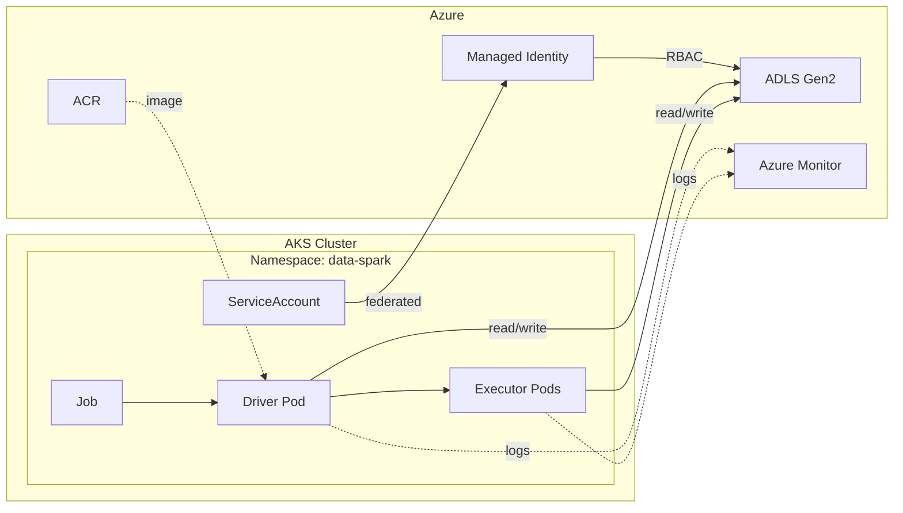

# Context
This real-world example demonstrates a minimal, production-shaped batch data pipeline using Apache Spark on Azure Kubernetes Service (AKS). A Spark job runs as a Kubernetes workload on-demand, reads raw data from Azure Data Lake Storage, performs a simple transformation, and writes curated output back to the lake. The goal is not feature completeness, but to validate that core components—AKS, containerized Spark, workload identity, storage access, and observability—work end-to-end in a realistic enterprise pattern.

**Definition of success (tracer-bullet lab)**

* AKS cluster is deployed and reachable; Spark node pool scales as jobs run.
* A Spark driver pod launches and successfully creates executor pods.
* The job reads a CSV from `raw/` in ADLS using workload identity (no secrets).
* Transform logic executes and writes Parquet/Delta output to `curated/`.
* Job completes successfully via a single on-demand Kubernetes Job.
* Logs are visible in Azure Monitor / pod logs.
* Be able to spin up resource group with IaC, then spin down when done using.

# Architecture Diagram

# User Execution

1. **Prepare input**

   * Upload a CSV file to ADLS Gen2 under `raw/` (e.g., `raw/sample.csv`).

2. **Build and publish job**

   * Package the PySpark script into a container image.
   * Push the image to Azure Container Registry.

3. **Deploy execution spec**

   * Apply Kubernetes manifests: Namespace, ServiceAccount, and Job.
   * The manifest defines the image and runs `spark-submit`.

4. **Run the job**

   * User triggers execution by creating the Job: `kubectl apply -f job.yml`

5. **Processing**

   * Spark driver pod starts, launches executor pods.
   * Spark reads CSV from `raw/`, transforms it, writes Parquet/Delta to `curated/`.

6. **Validate**

   * User checks pod status/logs.
   * Confirms curated data exists and row counts match expectations.

# MVP
1. **Provision Azure Resources - PowerShell Script (use az cli when possible)**
    - **Resource Group** – container for all resources
    - **AKS** – 1 system pool + 1 "spark" user pool with autoscaling
      - Enable **Workload Identity** and **OIDC Issuer**
    - **ACR** – Azure Container Registry for Spark job image
      - Attach ACR to AKS for image pull access
    - **ADLS Gen2** – Storage account with hierarchical namespace
      - Containers: `raw/`, `curated/`, `logs/`
    - **Managed Identity** – User-assigned identity for Spark workloads
      - Assign `Storage Blob Data Contributor` role on ADLS
    - **Log Analytics Workspace** – for Azure Monitor integration
      - Enable **Container Insights** on AKS
    - Be able to spin up resources (IaC), and then spin down after use
2. **K8s Baseline (Workload Identity Chain)**
    - Namespace `data-spark`
    - ServiceAccount `spark-sa` with:
      - Annotation: `azure.workload.identity/client-id: <managed-identity-client-id>`
      - Label: `azure.workload.identity/use: "true"`
    - **Federated Identity Credential** – links K8s ServiceAccount to Managed Identity
3. **Build PySpark Artifact**
    - Create `src/` folder with:
      - `main.py` – entry point script (read CSV → transform → write Parquet)
      - `requirements.txt` – Python dependencies (if any beyond Spark)
    - Transform logic:
      - Read `raw/sample.csv` from ADLS
      - Add derived column (e.g., `year` extracted from date)
      - Perform `groupby` aggregation
      - Write output to `curated/output/` as Parquet (or Delta)
    - Local validation:
      - Test script locally with `spark-submit` against sample data before containerizing
4. **Containerize & Push to ACR**
    - Create `Dockerfile`:
      - Base image: `apache/spark:3.5.1-python3`
      - Install `hadoop-azure` and `azure-identity` JARs for ADLS access
      - Copy `src/` into image
    - Build and push:
      - `az acr build --registry <acr-name> --image spark-job:v1 .`
5. **Deploy & Run Job**
    - Create Kubernetes `Job` manifest that:
      - Uses ServiceAccount `spark-sa`
      - References image from ACR
      - Runs `spark-submit --master k8s://...` (driver pod launches executor pods)
    - Apply: `kubectl apply -f job.yml`
6. **Validate**
    - Driver/executor pods completed successfully
    - Logs visible in pod stdout and Azure Monitor
    - `curated/output/` exists in ADLS with expected row count
7. **Observability**
    - Azure Monitor Container Insights enabled
    - Pod logs queryable via Log Analytics
    - Driver/executor metrics visible in Azure Portal