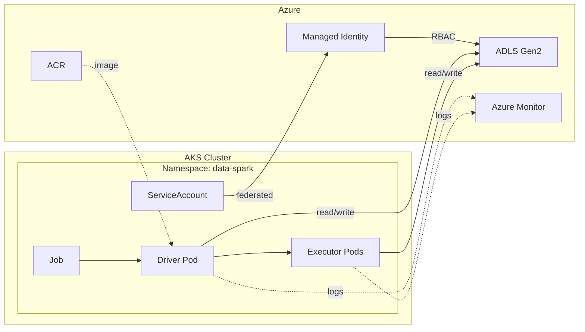

# Context
This real-world example demonstrates a minimal, production-shaped batch data pipeline using Apache Spark on Azure Kubernetes Service (AKS). A Spark job runs as a Kubernetes workload on-demand, reads raw data from Azure Data Lake Storage, performs a simple transformation, and writes curated output back to the lake. The goal is not feature completeness, but to validate that core components—AKS, containerized Spark, workload identity, storage access, and observability—work end-to-end in a realistic enterprise pattern.

**Definition of success (tracer-bullet lab)**

* AKS cluster is deployed and reachable; Spark node pool scales as jobs run.
* A Spark driver pod launches and successfully creates executor pods.
* The job reads a CSV from `raw/` in ADLS using workload identity (no secrets).
* Transform logic executes and writes Parquet/Delta output to `curated/`.
* Job completes successfully via a single on-demand Kubernetes Job.
* Logs are visible in Azure Monitor / pod logs.

# Architecture Diagram

# User Execution

1. **Prepare input**

   * Upload a CSV file to ADLS Gen2 under `raw/` (e.g., `raw/sample.csv`).

2. **Build and publish job**

   * Package the PySpark script into a container image.
   * Push the image to Azure Container Registry.

3. **Deploy execution spec**

   * Apply Kubernetes manifests: Namespace, ServiceAccount, and Job.
   * The manifest defines the image and runs `spark-submit`.

4. **Run the job**

   * User triggers execution by creating the Job: `kubectl apply -f job.yml`

5. **Processing**

   * Spark driver pod starts, launches executor pods.
   * Spark reads CSV from `raw/`, transforms it, writes Parquet/Delta to `curated/`.

6. **Validate**

   * User checks pod status/logs.
   * Confirms curated data exists and row counts match expectations.

# MVP
1. **Provision Resources - PowerShell Script (use az cli when possible)**
    - AKS (1 system pool + 1 “spark” user pool)
    - ACR (Azure Container Registry)
    - ADLS Gen2 container (`raw/`, `curated/`, `logs/`).
    - Enable **Azure Workload Identity** (no storage keys in pods).
    - Be able to spin up resources (IaC), and then spin down after use
2. **K8s baseline**
    - Namespace `data-spark`.
    - ServiceAccount `spark-sa` mapped to a managed identity with ADLS RBAC.
3. **Build job**
    - Simple PySpark app: read `raw/sample.csv` → add derived column + groupby → write `curated/output/` as Parquet (or Delta).
4. **Containerize**
    - Build image (Spark + hadoop-azure connector + your script) → push to ACR.
5. **Run once**
    - Submit via a Kubernetes **Job** that runs `spark-submit --master k8s://...` (driver pod launches executor pods).
6. **Validate**
    - Check: driver/executor pods succeeded, logs in stdout, `curated/output/` exists, row count matches expectation.
7. **Minimum observability**
    - Azure Monitor Container Insights enabled; pod logs visible for troubleshooting.